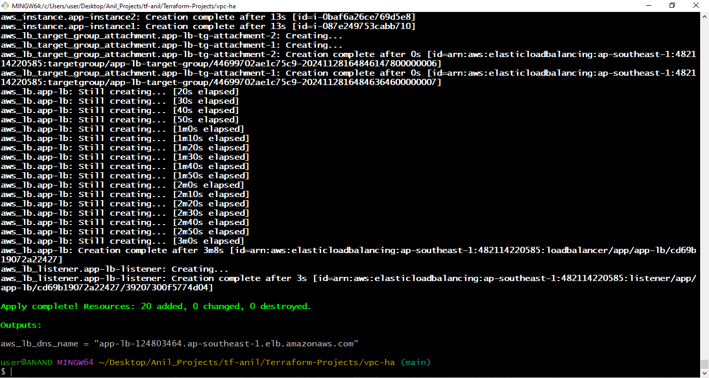
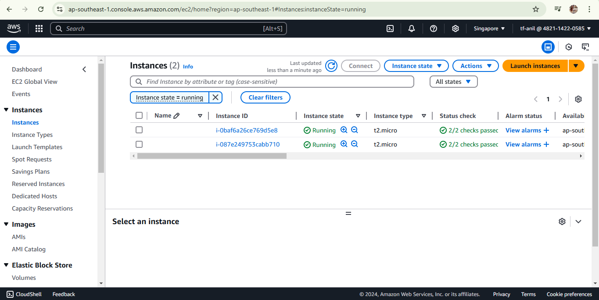
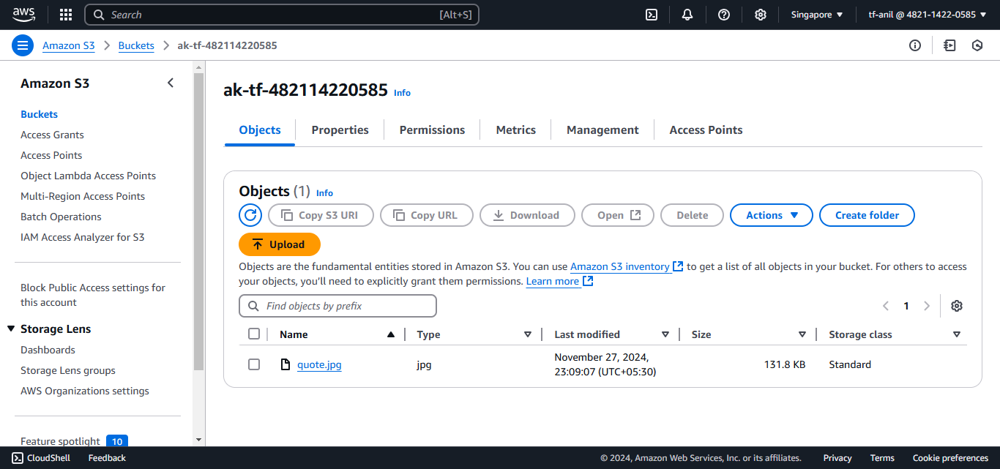
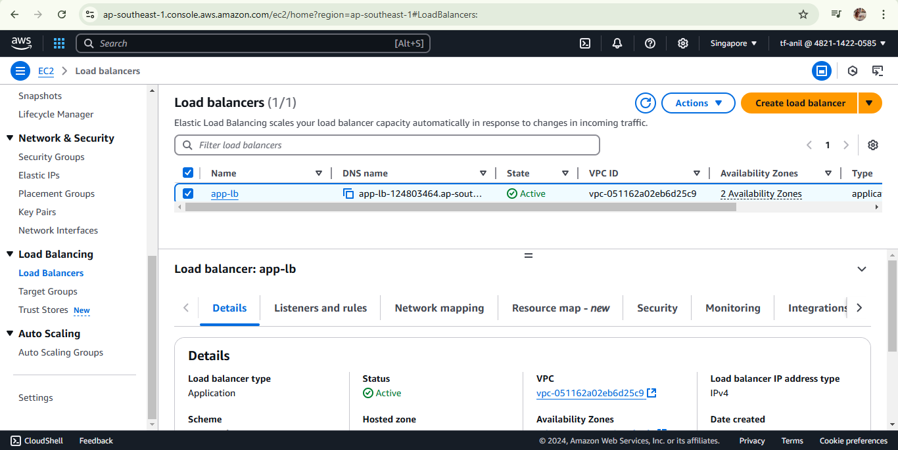
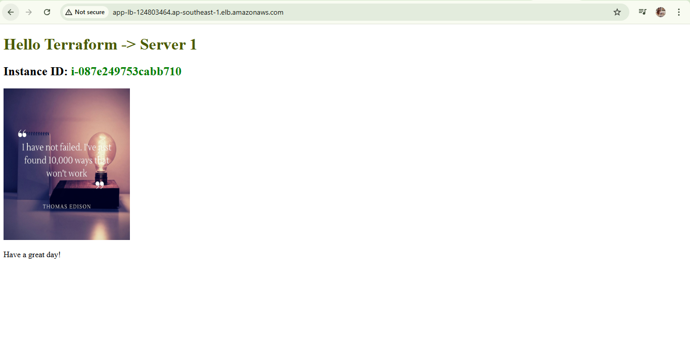
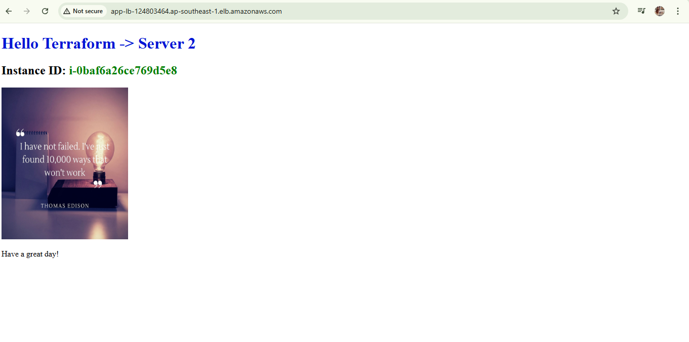

# Terraform-driven AWS Cloud Infrastructure 

Designed and implemented a scalable AWS infrastructure using Terraform, with VPC, IGW, subnets, route tables, route table associations, load balancer, target group, listeners, security group, ec2 instances, instance profile, IAM role. Modularized the project for reusability.

## Steps

### step 1 : run terraform init

init : downloads the plugin code and modules to interact with mentioned provider

```
terraform init 
```

### step 2 : run terraform plan 

plan : it's similar to dry-run. It validates the terraform scripts and gives an execution plan about all the resources it'll create or modify

```
terraform plan
```

### step 3 : run terraform apply 

apply : gives execution plan again and asks for yes/no prompt and performs accordingly 

```
terraform plan
```

### step 4 : run terraform destroy 

destroy : gives plan about all the resources it'll delete and asks for yes/no prompt

```
terraform destroy
```

## Demo

- Output after running Terraform apply

    

- Output of the EC2 console tab

    

- S3 bucket which contains image to be rendered on UI

    

- Output of the load balancer created on console

    

- Output when request is redirected to server1 when we send request with DNS name of LB

    

- Output when request is redirected to server2 when we send request with DNS name of LB

    